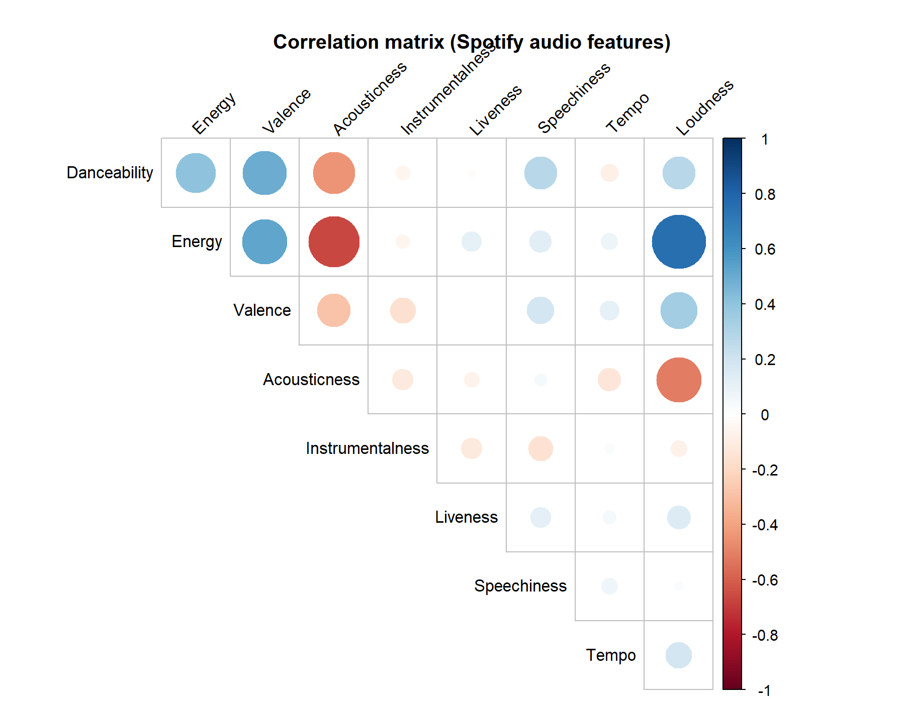

# Computational Musicology – Playlist Analysis

This project analyzes a personal Spotify playlist consisting of 101 favorite songs across multiple languages (Dutch, English), genres (rap, trap, R&B, pop), and artists (e.g., The Weeknd, Michael Jackson, Frenna).

Although the playlist appears stylistically diverse, feature-based analysis reveals structural consistencies.

---

# Week 7 – Corpus Description & Spotify Feature Visualisation

## Corpus Description (100–200 words)

The corpus consists of 101 tracks drawn from my personal Spotify favourites. The playlist spans Dutch and English repertoire and includes rap, drill, R&B, soul, pop, and alternative hip-hop. Rather than being curated around a single genre, the playlist reflects long-term listening habits, making it suitable for exploring whether perceived diversity aligns with measurable acoustic features.

The central research question is:

**Does my seemingly diverse musical taste share structural similarities when examined through computational audio features?**

Using Spotify’s track-level features (danceability, energy, popularity, etc.), this corpus allows comparison between genre labels and measurable musical properties. The dataset includes artists ranging from melodic rap and British drill to soul and Latin pop, providing contrast in rhythm, harmony, and production style while remaining part of a coherent personal listening profile.

---

## Spotify Feature Visualisation (ggplot2)

Below is a ggplot2 visualisation of track-level Spotify features:

- **X-axis:** Danceability  
- **Y-axis:** Energy  
- **Point size:** Popularity  
- **Colour:** Genre  
- **Text labels:** Selected outliers  

### What I hear vs what the plot shows

Most tracks cluster in the mid-to-high danceability range (roughly 0.6–0.8) with moderate energy. Listening-wise, this matches a clear preference for groove-forward tracks that stay rhythmically “driving,” even when genre and lyrical style change. Outliers (very low energy / acoustic-leaning tracks, or unusually high energy tracks) map onto moments in the playlist that feel like mood shifts rather than genre shifts.

The visual design aims to reduce chart junk while maximizing information density by encoding multiple variables in one plot (position, colour, size) and labeling notable tracks directly.

---

# Week 8 – Chroma Feature Visualisation (Sonic Visualiser)

For Week 8, I incorporated chroma features extracted using Sonic Visualiser. Chroma features represent pitch-class intensities (C, C#, D, etc.) over time and are useful for analysing harmonic structure beyond surface-level genre tags.

Below is a chromagram of **“Wanderlust.”**

## Description + listening interpretation

The chromagram visualises pitch-class intensity over time. Several pitch bands show recurring activation, suggesting a stable tonal centre with repeating harmonic material. This aligns with what I hear as structured repetition across sections (e.g., verse–chorus cycles), where the harmonic palette stays recognisable even when instrumentation and dynamics shift.

Brighter horizontal regions indicate pitch classes that dominate the track’s harmonic content, while changes in intensity correspond to perceived transitions and build-ups. Compared with the Spotify-feature view (Week 7), which highlights rhythm and energy preferences, this chroma visualisation points to harmonic consistency inside an individual track. Sonically, the piece feels melodically anchored and loop-like in its progressions; the repeating chroma patterns support that perception by showing similar pitch distributions returning across time.

---

## Correlation Analysis (Week 9)

A correlation matrix of Spotify audio features (danceability, energy, valence, acousticness, etc.) shows strong relationships between energy and loudness, and moderate clustering of danceability across genres. This suggests that emotional intensity and rhythm play a stronger role in musical preference than genre labels.

### Correlation Matrix

The correlation matrix shows a strong positive correlation between **Energy and Loudness (r = 0.75)** and a strong negative correlation between **Energy and Acousticness (r = -0.67)**.

This indicates that the playlist is structurally organized around **production intensity** rather than genre labels. High-energy tracks tend to be louder and less acoustic, while more acoustic tracks cluster at lower energy levels.

Despite genre diversity (rap, trap, R&B, pop, bachata), the playlist exhibits consistent audio-feature patterns centered on intensity and production style.

---

## Self-Similarity Matrix (Week 9)

A feature-based self-similarity matrix reveals block structures, indicating clusters of songs with similar timbral and rhythmic characteristics. Despite genre differences, many tracks share comparable energy–valence profiles.

### Interpretation

The analysis suggests that musical preference may be organized around mood and sonic intensity rather than genre. This helps explain how artists as different as Michael Jackson and modern trap artists coexist within the same preference structure.
