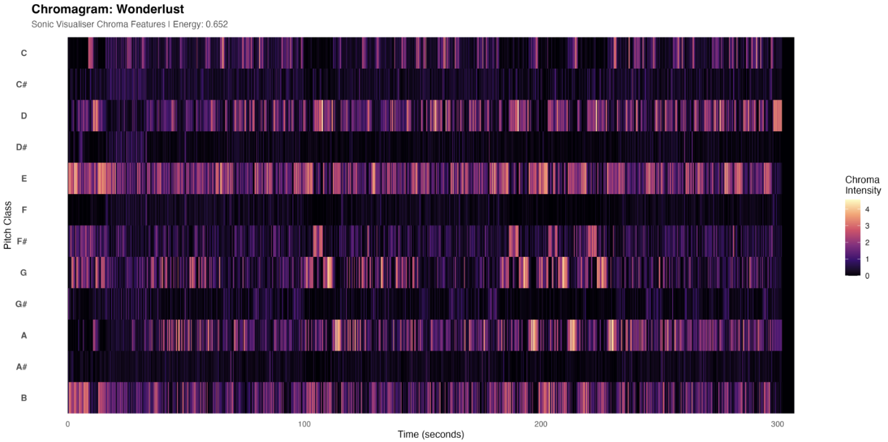

# Chroma Features

## Highlight Track: The Weeknd – Wanderlust

## Interpretation

The chromagram shows recurring activation of specific pitch classes over time, indicating a stable tonal centre and repeated harmonic patterns.

## What this means

Rather than exhibiting harmonic complexity or frequent modulation, the track relies on loop-based harmonic structures. These repeating pitch distributions align with a consistent and recognisable musical foundation.

## Connection to the research question

Although the playlist appears stylistically diverse, this suggests that harmonic behaviour may be more consistent than expected across tracks.

## Key Insight

The playlist shows **harmonic consistency through stable tonal centres and repetition**.
