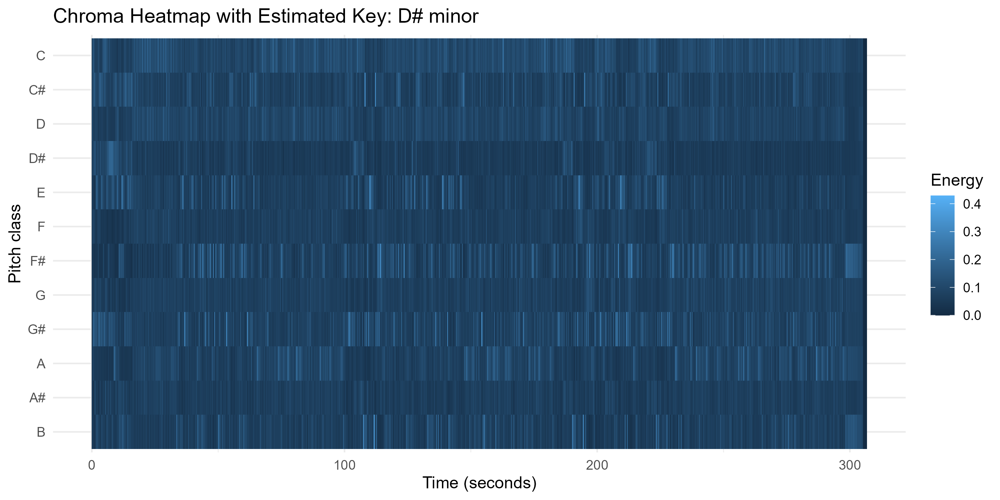
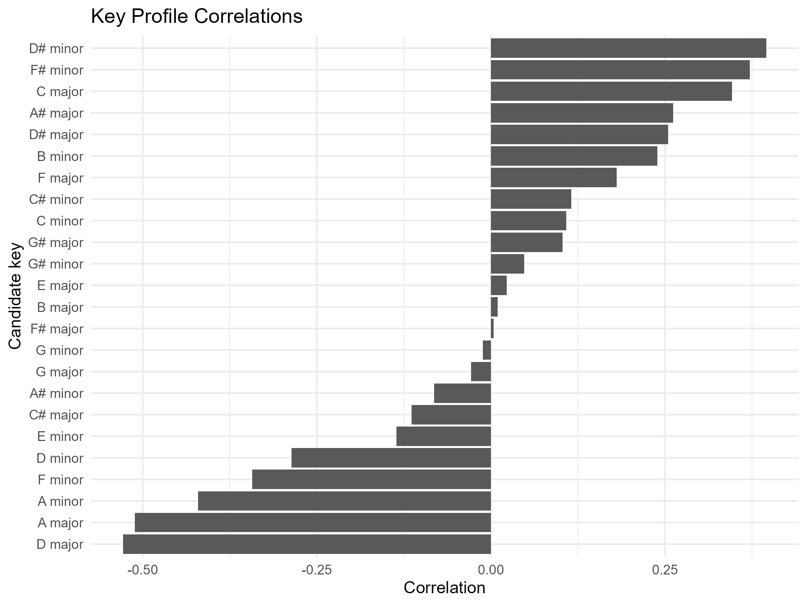
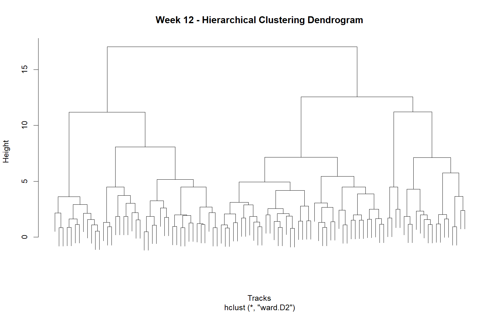

## Introduction

This project analyzes a personal Spotify playlist consisting of 100+ favorite songs across multiple languages (Dutch, English & Spanish), genres (rap, trap, R&B, pop), and artists (e.g., The Weeknd, Michael Jackson, Frenna, Coldplay, 2pac).

Although the playlist appears stylistically diverse, does feature-based analysis reveal structural consistencies?

---

## Week 7 – Corpus Description & Spotify Feature Visualisation

### Corpus Description

The corpus consists of 20 (later expended to 101) tracks drawn from my personal Spotify favourites. The playlist spans Dutch and English repertoire and includes rap, drill, R&B, soul, pop, and alternative hip-hop. Rather than being curated around a single genre, the playlist reflects long-term listening habits, making it suitable for exploring whether perceived diversity aligns with measurable acoustic features.

The central research question is:

**Does my seemingly diverse musical taste share structural similarities when examined through computational audio features?**

Using Spotify’s track-level features (danceability, energy, popularity, etc.), this corpus allows comparison between genre labels and measurable musical properties. The dataset includes artists ranging from melodic rap and British drill to soul and Latin pop, providing contrast in rhythm, harmony, and production style while remaining part of a coherent personal listening profile.

### Spotify Feature Visualisation (ggplot2)

Below is a ggplot2 visualisation of track-level Spotify features:

- **X-axis:** Danceability  
- **Y-axis:** Energy  
- **Point size:** Popularity  
- **Colour:** Genre  
- **Text labels:** Selected outliers  

### What I hear vs what the plot shows

Most tracks cluster in the mid-to-high danceability range (roughly 0.6–0.8) with moderate energy. Listening-wise, this matches a clear preference for groove-forward tracks that stay rhythmically “driving,” even when genre and lyrical style change. Outliers (very low energy / acoustic-leaning tracks, or unusually high energy tracks) map onto moments in the playlist that feel like mood shifts rather than genre shifts.

The visual design aims to reduce chart junk while maximizing information density by encoding multiple variables in one plot (position, colour, size) and labeling notable tracks directly.

---

## Week 8 – Chroma Feature Visualisation (Sonic Visualiser)

For Week 8, I incorporated chroma features extracted using Sonic Visualiser. Chroma features represent pitch-class intensities (C, C#, D, etc.) over time and are useful for analysing harmonic structure beyond surface-level genre tags.

Below is a chromagram of **“Wanderlust”** by The Weeknd

### Description + listening interpretation

The chromagram visualises pitch-class intensity over time. Several pitch bands show recurring activation, suggesting a stable tonal centre with repeating harmonic material. This aligns with what I hear as structured repetition across sections (e.g., verse–chorus cycles), where the harmonic palette stays recognisable even when instrumentation and dynamics shift.

Brighter horizontal regions indicate pitch classes that dominate the track’s harmonic content, while changes in intensity correspond to perceived transitions and build-ups. Compared with the Spotify-feature view (Week 7), which highlights rhythm and energy preferences, this chroma visualisation points to harmonic consistency inside an individual track. Sonically, the piece feels melodically anchored and loop-like in its progressions; the repeating chroma patterns support that perception by showing similar pitch distributions returning across time.

---

## Correlation Analysis (Week 9)

A correlation matrix of Spotify audio features (danceability, energy, valence, acousticness, etc.) shows strong relationships between energy and loudness, and moderate clustering of danceability across genres. This suggests that emotional intensity and rhythm play a stronger role in my musical preference than genre labels.

### Correlation Matrix

The correlation matrix shows a strong positive correlation between **Energy and Loudness (r = 0.75)** and a strong negative correlation between **Energy and Acousticness (r = -0.67)**.

This indicates that the playlist is structurally organized around **production intensity** rather than genre labels. High-energy tracks tend to be louder and less acoustic, while more acoustic tracks cluster at lower energy levels.

Despite genre diversity (rap, trap, R&B, pop, bachata), the playlist exhibits consistent audio-feature patterns centered on intensity and production style.

---

## Timbre-Based Self-Similarity Matrix (MFCC)

This self-similarity matrix is computed using MFCC features, which capture timbral and production characteristics rather than pitch content. The strong diagonal reflects temporal continuity, while subtle block-like contrasts suggest sectional differentiation.

Listening to the track, the harmonic loop feels relatively stable, but changes in production density and vocal layering mark transitions between sections. The MFCC-based SSM reflects this: the structure is visible, but less sharply segmented than what a pitch-based representation would show. This suggests that the track’s formal clarity is driven more by harmonic repetition than by radical timbral contrast.

---

## Week 10 – Analysis of Keys or Chords

To extend the harmonic analysis, I estimated the tonal centre of one track in the corpus using a chroma-based pitch-class representation in R.

The heatmap shows how pitch-class energy is distributed over time. Recurrent emphasis on the same pitch classes suggests harmonic stability rather than frequent modulation.

The key-profile comparison indicates the most likely global key for the track. Even if the estimate should be interpreted cautiously, it supports the idea that the track is organized around a relatively stable tonal centre and a repeating harmonic framework.

---

## Week 11 – Rhythm and Tempo Analysis

This week extends the dashboard with a rhythm-based perspective by focusing on tempo. Since the dataset includes Spotify audio features, tempo can be used as a measurable indicator of rhythmic pacing in the corpus. Expressed in beats per minute (BPM), it helps reveal whether the playlist is rhythmically varied or concentrated around a more limited range.

### Tempo Distribution in the Corpus

The histogram shows how tempo values are distributed across the playlist. If many tracks cluster within a similar BPM range, this suggests that the corpus has a degree of rhythmic consistency despite its stylistic diversity.

This supports the broader idea behind the dashboard: even when the playlist spans multiple genres and artists, computational analysis can still reveal recurring musical preferences.

---

## Week 12 – Hierarchical Clustering

For Week 12, I applied hierarchical clustering to explore patterns in the class corpus based on Spotify audio features. Instead of using a supervised approach, hierarchical clustering allows the data itself to reveal natural groupings between tracks.

I selected the track-level features Danceability, Energy, Valence, Tempo, Acousticness, Speechiness, and Liveness. Because these features are measured on different scales, they were first standardized. I then calculated Euclidean distances between tracks and applied hierarchical clustering using Ward’s method.

The resulting dendrogram is shown below.

The dendrogram reveals that the playlist is not a random collection of tracks, but contains clear structural groupings. At higher levels in the tree, the data splits into a few main clusters, indicating that certain groups of tracks are more similar to each other than to the rest of the corpus.

Although individual tracks are not easily readable due to the size of the dataset, the overall structure is still informative. The clustering suggests that the playlist can be divided into groups that likely reflect differences in musical characteristics such as energy, danceability, and acoustic qualities.

To further interpret the clusters, I compared average feature values per group. This showed that some clusters contain more energetic and danceable tracks, while others are characterized by lower energy and higher acousticness. A third group appears to represent intermediate or mixed characteristics.

Overall, hierarchical clustering provides a useful way to visualize similarity relationships within the corpus. The results demonstrate that even a diverse playlist contains underlying structure when analyzed using audio features.
