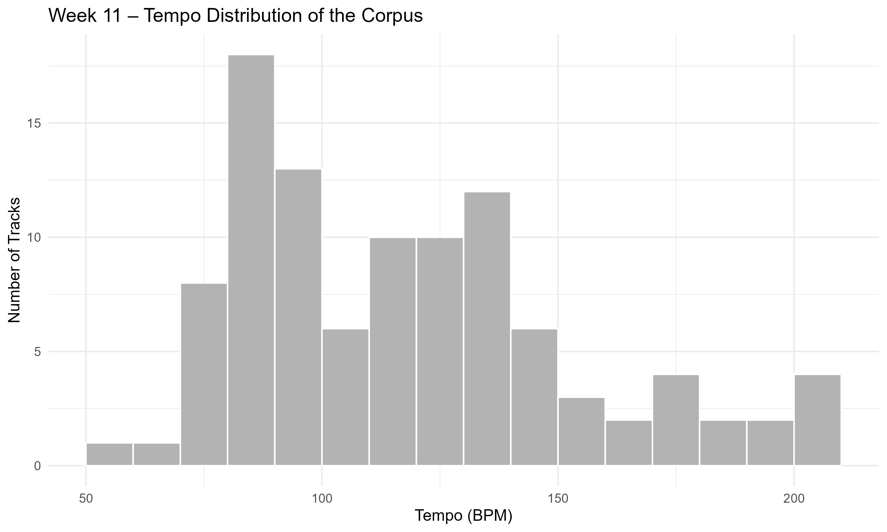

## Interpretation

Tempo values cluster within a relatively narrow BPM range.

## What this means

Despite genre diversity, the playlist maintains a consistent rhythmic pacing.

## Connection to the research question

This reinforces the idea that rhythmic structure is a unifying factor across the corpus.

## Key Insight

The playlist shows **rhythmic consistency across stylistically diverse tracks**.
