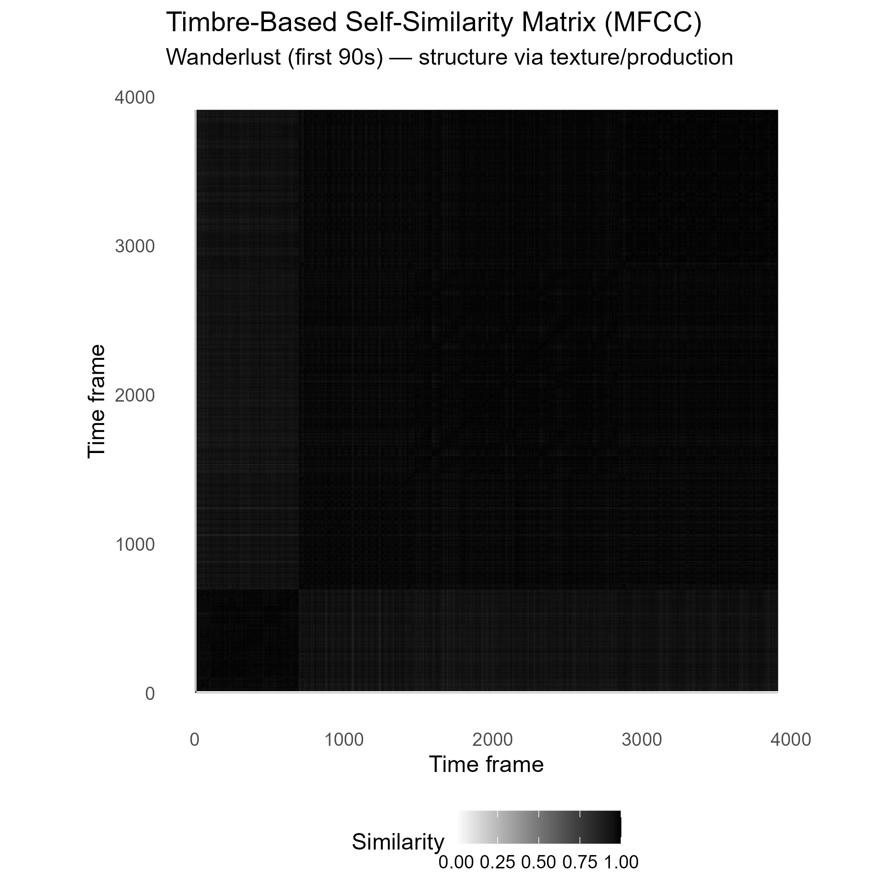

## Interpretation

The self-similarity matrix shows a largely continuous structure with only subtle block-like patterns. While the diagonal line confirms temporal progression, there are faint off-diagonal similarities indicating repeated sections, but without sharply defined boundaries.

## What this means

Timbral variation in the track is relatively smooth and gradual. Instead of strong contrasts between sections, changes occur through shifts in texture, layering, and production density. This results in sections that are related rather than clearly separated, giving the track a cohesive sonic identity.

## Connection to the research question

Despite stylistic diversity within the playlist, this suggests that timbral structure follows a consistent pattern of gradual evolution rather than abrupt change. Structural variation is therefore not primarily driven by timbre.

## Key Insight

The track exhibits **timbral continuity with limited contrast**, reinforcing the idea that structure is shaped more by repetition and layering than by distinct changes in sound texture.
