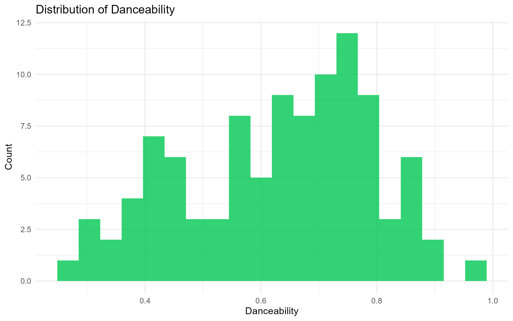
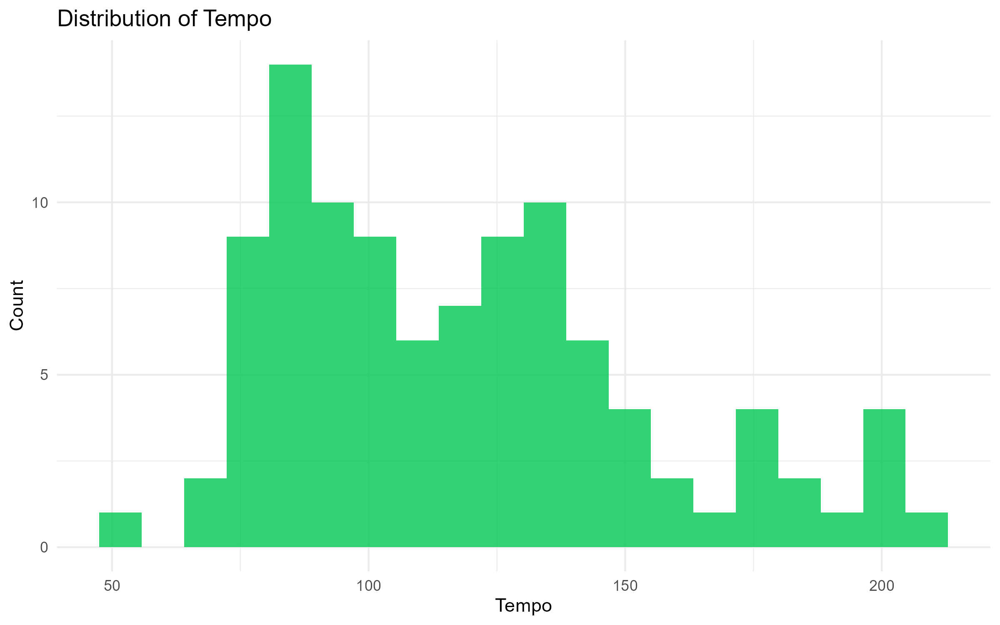
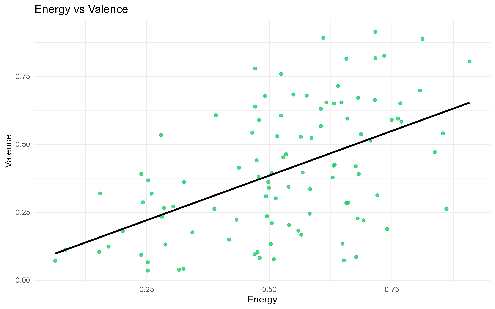
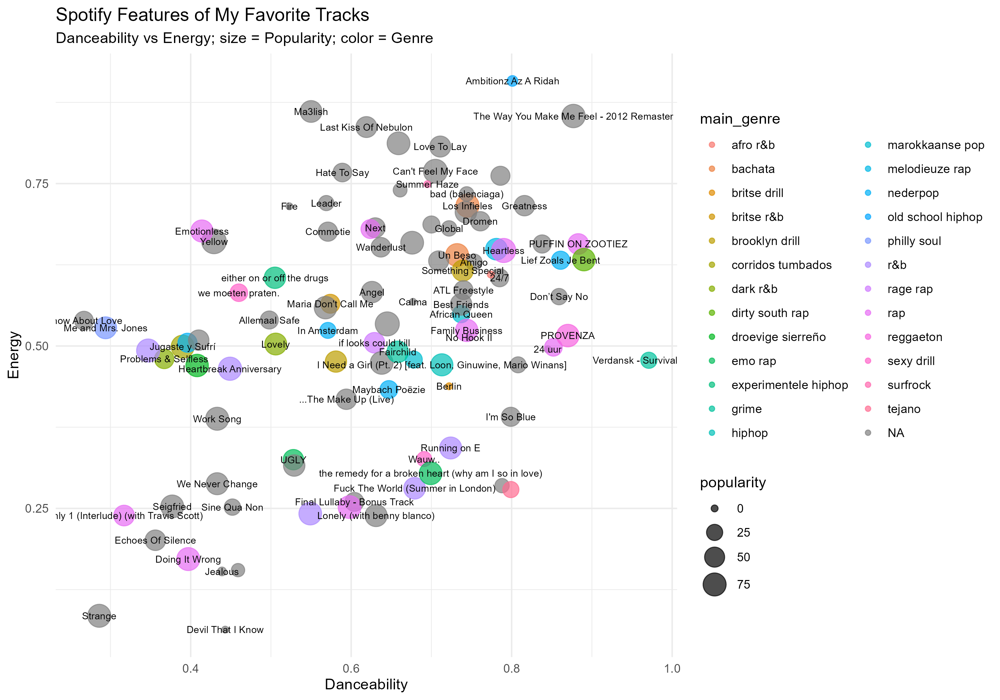

This section examines Spotify’s track-level audio features to determine whether my favorite songs share consistent underlying characteristics, despite their diversity in genre, language, and artist.

The analysis focuses on six key features: danceability, energy, valence, tempo, loudness, and popularity. Together, these features capture how music feels rhythmically, emotionally, and physically.

## Feature Distributions Across the Playlist

The distributions show that most tracks fall within a relatively narrow range of danceability, with a strong concentration in the mid-to-high range. This suggests a consistent preference for rhythmically engaging music.

Tempo shows more variation, but still clusters around common ranges used in popular music. While the playlist spans multiple genres, it avoids extreme values, indicating a preference for familiarity in pacing.

## Core Relationship: Energy vs Valence

This plot shows the relationship between energy and valence across all tracks.

While higher energy levels tend to correlate slightly with higher valence, the spread is wide. This indicates that tracks can be energetic without necessarily being emotionally positive.

This variation suggests that emotional tone is flexible within the playlist, while energy remains a more consistent driver of preference.

## Danceability vs Energy

This visualization combines multiple dimensions: danceability, energy, popularity, and genre.

Most tracks cluster within a similar region of mid-to-high danceability and moderate energy, regardless of genre or language. This reinforces the idea that personal preference is not primarily genre-driven, but instead centered around rhythmic and structural characteristics.

Outliers exist, but they reflect shifts in mood rather than entirely different listening preferences.

## Feature Summary Statistics

The table below provides summary statistics for all track-level features.

<iframe 
src="feature-summary.html" 
width="100%" 
height="400" 
style="border:none;">
</iframe>

## Key Findings

The playlist shows a clear pattern of consistency across several features.

Danceability is relatively high and tightly distributed, indicating a strong preference for rhythmically engaging tracks. Energy is also consistently moderate to high, reinforcing this pattern.

Valence shows more variation, suggesting that emotional tone is less important than rhythmic and structural qualities. Tempo varies more widely than expected, but still avoids extreme values.

Overall, the results indicate that personal music preference is not random, but driven by a consistent set of underlying audio characteristics — particularly rhythm and energy.

These patterns suggest that personal music preference is shaped more by consistent structural features than by genre or language.
