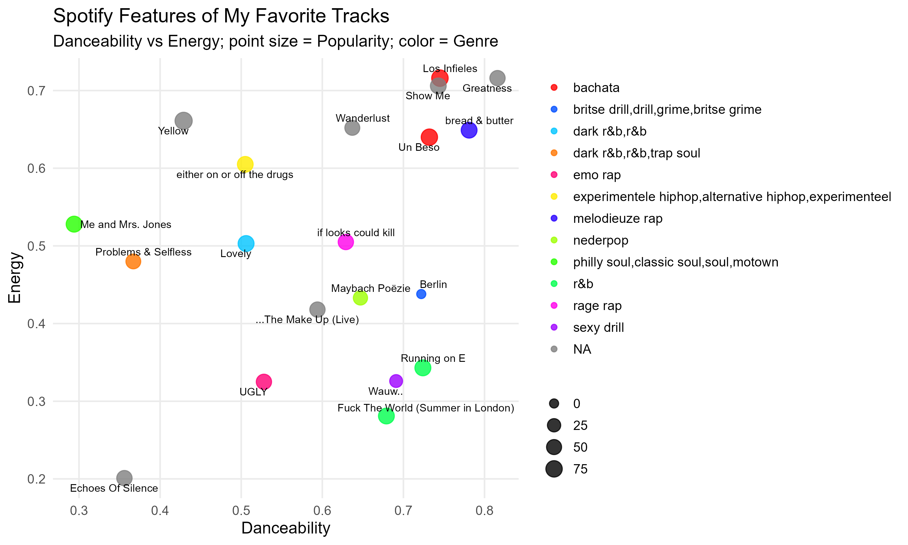

# Track-level Features

## Interpretation

Most tracks cluster in the mid-to-high danceability range (0.6–0.8) with moderate energy levels.

## What this means

Despite differences in genre and language, the playlist shows a clear preference for rhythmically engaging tracks with consistent groove and pacing.

Outliers correspond to perceptible mood shifts, rather than structural differences between genres.

## Key Insight

The playlist is not genre-driven, but **rhythm and energy driven**.
